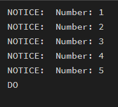
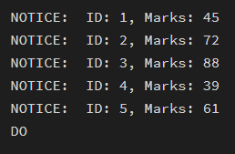
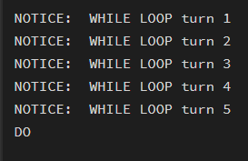
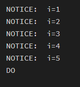
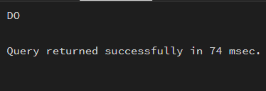
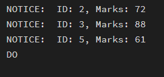

# 🔹 Experiment – 03

## **Title**

Implementation of Iterative Control Structures using FOR, WHILE, and LOOP in PostgreSQL

---

## 🎯 Aim

To understand and implement iterative control structures in PostgreSQL conceptually, including FOR loops, WHILE loops, and basic LOOP constructs, for repeated execution of database logic.

---

## 🖥️ Software Requirements
- Oracle Database Express Edition  
- pgAdmin (PostgreSQL)

---

## 🎯 Objective
After completing this practical, the learner will be able to:
•	To understand why iteration is required in database programming
•	To learn the purpose and behavior of FOR, WHILE, and LOOP constructs
•	To understand how repeated data processing is handled in databases
•	To relate loop concepts to real-world batch processing scenarios
•	To strengthen conceptual knowledge of procedural SQL used in enterprise systems.

---

## 🧪 Practical / Experiment Steps
a.	Start the system.
b.	Open pgAdmin.
c.	Create and select the database in which you want to perform the experiment.
d.	Establish connection to the database using Alt+Shift+Q.
e.	Run the following queries given in Experiment Steps (5).

---

## ⚙️ Procedure of the Practical

1. Start the system and log in
2. Start the PostgreSQL service
3. Open PostgreSQL client (psql or pgAdmin)
4. Create a new database
5. Create the required table
6. Insert sample data into the table
7. Execute SELECT queries for LOOP, WHILE, FOR
8. Ensure successful execution of queries
9. Save the work for documentation

---

## 🧾 SQL Queries Used

### For Loop (simple iteration):

```sql
DO $$
BEGIN
  FOR i IN 1..5 LOOP
    RAISE NOTICE 'Number: %', i;
  END LOOP;
END $$;
```

---
 
### For Loop with Query (Row-by-Row Processing):

```sql
DO $$
DECLARE
    rec RECORD;
BEGIN
    FOR rec IN
        SELECT id, marks FROM  students
    LOOP
        RAISE NOTICE 'ID: %, Marks: %', rec.id, rec.marks;
    END LOOP;
END $$; 
```

---

### While Loop (conditional iteration):

```sql
DO $$
DECLARE
	i int:=1;
BEGIN
	WHILE i<=5 LOOP
		RAISE NOTICE 'WHILE LOOP turn %',i;
		i:=i+1;
	END LOOP;
END $$
```

---
 

### Loop with ‘EXIT WHEN’:

```sql
DO $$
DECLARE
	i int :=1;
BEGIN
	LOOP
		RAISE NOTICE 'i=%',i;
		i:=i+1;
		EXIT WHEN i>5;
	END LOOP;
END $$;
```

---
 

### Salary increment using For Loop:

```sql
DO $$
DECLARE
    rec RECORD;
BEGIN
    FOR rec IN
        SELECT id, salary FROM salaries
    LOOP
        UPDATE salaries
        SET salary = rec.salary * 1.10
        WHERE id = rec.id;
    END LOOP;
END $$;
```

---

### Combining Loop with IF condition:

```sql
DO $$
DECLARE
    rec RECORD;
BEGIN
    FOR rec IN
        SELECT id, marks FROM students
    LOOP
        IF rec.marks > 50 THEN
            RAISE NOTICE 'ID: %, Marks: %', rec.id, rec.marks;
        END IF;
    END LOOP;
END $$;
```

---

## 📥 Input / Output Details

### Input:

* SQL commands for database creation
* Table creation and data insertion
* Looping, FOR Loop, WHILE Loop queries

### Output:
  
•	For Loop (simple iteration):



 

•	For Loop with Query (Row-by-Row Processing):



 

•	While Loop (conditional iteration):



 
•	Loop with ‘EXIT WHEN’:


 
•	Salary increment using For Loop:

 
 

•	Combining Loop with IF condition:

 
 

6.	Learning Outcome
a.	Understanding of how iterative control structures work in PostgreSQL at a conceptual level. 
b.	Usage of loops in database systems, such as workflow engines, complex decision cycles, validation loops, etc.
c.	Foundational knowledge required for writing procedural logic in enterprise-grade applications.
