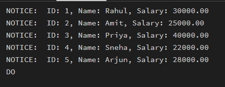
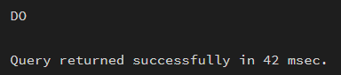
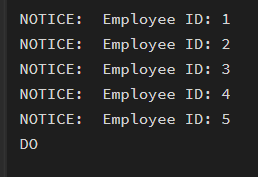

# 🔹 Experiment – 05

## **Title**

Row-by-Row Processing Using Cursors in PostgreSQL

---

## 🎯 Aim

To understand and implement iterative control structures in PostgreSQL conceptually, including FOR loops, WHILE loops, and basic LOOP constructs, for repeated execution of database logic.

---


## 🖥️ Software Requirements

* Oracle Database Express Edition
* MS SQL Server Management Studio (SSMS)
* pgAdmin (PostgreSQL)

---

## 🎯 Objective

After completing this practical, the learner will be able to:

• Understand sequential row-by-row data access using cursors
• Learn cursor lifecycle: DECLARE, OPEN, FETCH, CLOSE
• Perform conditional row-level manipulation
• Handle termination conditions and exceptions
• Apply cursor-based logic in real-world enterprise systems

---

## 🧪 Practical / Experiment Steps

a. Start the system
b. Open pgAdmin / SQL client
c. Create and select the required database
d. Create Employee table
e. Insert sample data
f. Execute cursor-based queries

---

## ⚙️ Procedure of the Practical

1. Start the system and log in
2. Start PostgreSQL service
3. Open PostgreSQL client
4. Create Employee table
5. Insert sample records
6. Declare and implement cursor
7. Execute FETCH operations
8. Close the cursor properly
9. Save output for documentation

---


## 🧾 SQL Queries Used

### Simple Forward-Only Cursor

```sql
DO $$
DECLARE
    rec RECORD;
    emp_cursor CURSOR FOR
        SELECT id, name, salary FROM employee;
BEGIN
    OPEN emp_cursor;
    LOOP
        FETCH emp_cursor INTO rec;
        EXIT WHEN NOT FOUND;
        RAISE NOTICE 'ID: %, Name: %, Salary: %', rec.id, rec.name, rec.salary;
    END LOOP;
    CLOSE emp_cursor;
END $$;
```

---

### Salary Update using Cursor

```sql
DO $$
DECLARE
    rec RECORD;
    emp_cursor CURSOR FOR
        SELECT id, experience, salary FROM employee;
BEGIN
    OPEN emp_cursor;
    LOOP
        FETCH emp_cursor INTO rec;
        EXIT WHEN NOT FOUND;

        IF rec.experience > 5 THEN
            UPDATE employee
            SET salary = salary * 1.20
            WHERE id = rec.id;
        ELSE
            UPDATE employee
            SET salary = salary * 1.10
            WHERE id = rec.id;
        END IF;
    END LOOP;
    CLOSE emp_cursor;
END $$;
```

---

### Cursor with Exception Handling

```sql
DO $$
DECLARE
    rec RECORD;
    emp_cursor CURSOR FOR SELECT id FROM employee;
BEGIN
    OPEN emp_cursor;
    LOOP
        FETCH emp_cursor INTO rec;
        EXIT WHEN NOT FOUND;
        RAISE NOTICE 'Employee ID: %', rec.id;
    END LOOP;
    CLOSE emp_cursor;
EXCEPTION
    WHEN OTHERS THEN
        RAISE NOTICE 'An error occurred while processing cursor.';
END $$;
```

---

## 📥 Input / Output Details

### Input:

* Employee table creation
* Data insertion
* Cursor implementation queries

### Output:

•   Simple Forward-Only Cursor




•   Salary Update using Cursor




•   Cursor with Exception Handling



---

## 📘 Learning Outcome

a. Understanding of cursor lifecycle in PostgreSQL
b. Ability to implement row-by-row processing
c. Application of cursors in payroll and enterprise systems

---
