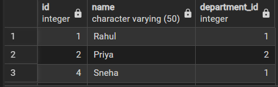
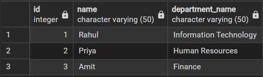
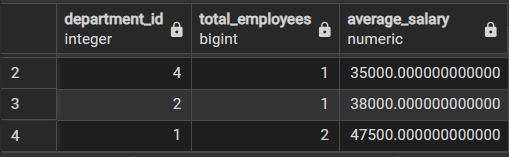

# 🔹 Experiment – 06

## **Title**

Creation and Management of Views in PostgreSQL

---

## 🎯 Aim

To learn how to create, query, and manage views in SQL to simplify database queries and provide abstraction for end-users.

---

## 🖥️ Software Requirements

* Oracle Database Express Edition
* MS SQL Server Management Studio (SSMS)
* pgAdmin (PostgreSQL)

---

## 🎯 Objective

After completing this practical, the learner will be able to:

• Understand the concept of data abstraction using views
• Create simple and complex views
• Restrict access to sensitive columns
• Manage views using CREATE, ALTER, DROP
• Apply views in real-world enterprise applications

---

## 🧪 Practical / Experiment Steps

a. Start the system
b. Open SQL client
c. Create Employees and Departments tables
d. Insert sample data
e. Create views
f. Execute SELECT queries

---

## ⚙️ Procedure of the Practical

1. Start PostgreSQL service
2. Create and select database
3. Create base tables
4. Insert sample data
5. Create simple and complex views
6. Execute view queries
7. Save output

---

## 🧾 SQL Queries Used

### Simple View

```sql
CREATE VIEW active_employees AS
SELECT id, name, department_id
FROM employees
WHERE status = 'Active';
```

---

### Join View

```sql
CREATE VIEW employee_department_view AS
SELECT e.id, e.name, d.department_name
FROM employees e
JOIN departments d
ON e.department_id = d.department_id;
```

---

### Summary View

```sql
CREATE VIEW department_summary AS
SELECT department_id,
       COUNT(*) AS total_employees,
       AVG(salary) AS average_salary
FROM employees
GROUP BY department_id;
```

---

## 📥 Input / Output Details

### Input:

* Table creation
* Data insertion
* View creation queries

### Output:
•   Simple View




•   Joins




•   Summarize




---

## 📘 Learning Outcome

a. Understanding of view abstraction
b. Ability to simplify complex queries
c. Knowledge of security implementation using views
d. Practical exposure to enterprise reporting systems

---