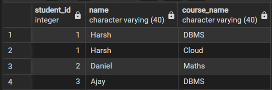
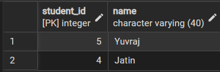
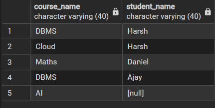
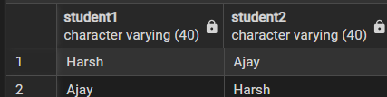
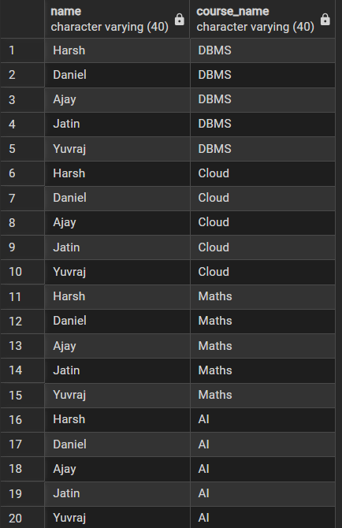

# 🔹 Experiment – 07

## **Title**

Joins in PostgreSQL

---

## 🎯 Aim

Implementation of joins in PostgreSQL (inner join ,left join, right join, self-join and cross join)

---

## 🖥️ Software Requirements

* Oracle Database Express Edition
* MS SQL Server Management Studio (SSMS)
* pgAdmin (PostgreSQL)

---

## 🎯 Objective

Apply joins to a real-world database schema (e.g., Students, Courses, Enrollments, Departments)

---

## 🧪 Practical / Experiment Steps

a.	Start the system

b.  Open pgAdmin

c.	Create and select the database in which you want to perform the experiment

d.	Establish connection to the database

e.	Create tables (Students, Courses, Enrollments, Departments)

f.	Execute SELECT queries using different joins

---

## ⚙️ Procedure of the Practical

1.	Start the system and log in 
2.	Start the PostgreSQL service 
3.	Open PostgreSQL client (psql or pgAdmin) 
4.	Create a new database 
5.	Create the required tables 
6.	Insert sample data into the tables 
7.	Apply different joins (INNER, LEFT, RIGHT, SELF, CROSS) 
8.	Execute queries and verify results 
9.	Save the work for documentation

---

## 🧾 SQL Queries Used

### Table Creation
```
CREATE TABLE departments (
    department_id SERIAL PRIMARY KEY,
    department_name VARCHAR(40)
);

CREATE TABLE students (
    student_id SERIAL PRIMARY KEY,
    name VARCHAR(40),
    department_id INT,
    FOREIGN KEY (department_id) REFERENCES departments(department_id)
);

CREATE TABLE courses (
    course_id SERIAL PRIMARY KEY,
    course_name VARCHAR(40)
);

CREATE TABLE enrollments (
    student_id INT,
    course_id INT,
    PRIMARY KEY (student_id, course_id),
    FOREIGN KEY (student_id) REFERENCES students(student_id),
    FOREIGN KEY (course_id) REFERENCES courses(course_id)
);
```

---

### Data Insertion
```
INSERT INTO departments (department_name) VALUES
('Computer Science'),
('Mechanical'),
('Electrical');

INSERT INTO students (name, department_id) VALUES
('Harsh', 1),
('Daniel', 2),
('Ajay', 1),
('Jatin', 3),
('Yuvraj', NULL);  

INSERT INTO courses (course_name) VALUES
('DBMS'),
('Cloud'),
('Maths'),
('AI');

INSERT INTO enrollments (student_id, course_id) VALUES
(1, 1),
(1, 2),
(2, 3),
(3, 1);
```

---

### Write queries to list students with their enrolled courses (INNER JOIN).
```
SELECT 
    s.student_id,
    s.name,
    c.course_name
FROM students s
INNER JOIN enrollments e 
    ON s.student_id = e.student_id
INNER JOIN courses c 
    ON e.course_id = c.course_id;
```

---

### Find students not enrolled in any course (LEFT JOIN).
```
SELECT 
    s.student_id,
    s.name
FROM students s
LEFT JOIN enrollments e 
    ON s.student_id = e.student_id
WHERE e.student_id IS NULL;
```

---

### Display all courses with or without enrolled students (RIGHT JOIN).
```
SELECT 
    c.course_name,
    s.name AS student_name
FROM enrollments e
RIGHT JOIN courses c 
    ON e.course_id = c.course_id
LEFT JOIN students s 
    ON e.student_id = s.student_id;
```

---

### Show students with department info using SELF JOIN or multiple joins.
```
SELECT 
    s1.name AS student1,
    s2.name AS student2
FROM students s1
JOIN students s2 
    ON s1.department_id = s2.department_id
WHERE s1.student_id <> s2.student_id;
```

---

### Display all possible student-course combinations (CROSS JOIN).
```
SELECT 
    s.name,
    c.course_name
FROM students s
CROSS JOIN courses c;
```

---

## 📥 Input / Output Details

### Input:

* Table creation
* Data insertion
* Joins

### Output:
•  Inner Join




•   Left Join




•   Right Join




•   Self Join




•   Cross Join




---

## 📘 Learning Outcome

•	Understanding different types of joins in PostgreSQL

•	Ability to combine data from multiple tables

•	Knowledge of handling real-world relational database queries

•	Practical implementation of relational database concepts

•	Improved SQL query writing skills for data analysis

---