# Project Report on Library Management System

## TABLE OF CONTENTS

|S. NO|	PARTICULARS|	
|-----|------------|
|1.	  |Abstract	  |
|2.	  |Problem Statement  |
|3.	  |Introduction
|4.	  |Aim of the Project  |
|5.	  |Technologies Used  |
|6.	  |Implementation  |
|7.	  |Results
|8.	  |Output  |
|9.	  |Future Development  |
|10.  |	Conclusion
|11.  |	Learning Outcomes  |
|12.  |	References and GitHub Repository Link  |

  
## Abstract

The **Library Management System** is a relational database project designed to demonstrate the principles of data modeling, normalization, and efficient data retrieval. Developed as part of the DBMS curriculum, this project leverages PostgreSQL to construct a robust and scalable backend infrastructure for managing library operations.

The core architecture consists of interconnected relational tables handling data for books, members, borrowing records, and fines. To ensure data integrity, primary and foreign key constraints are strictly enforced. Moving beyond basic CRUD operations, the system successfully automates routine tasks through the implementation of PL/pgSQL stored procedures and triggers—such as automatically adjusting inventory counts upon checkout and automatically calculating late penalties. Ultimately, this implementation bridges theoretical database concepts with practical scenarios, showcasing how modern institutions maintain organized, automated, and accessible data repositories. 
Problem Statement

Traditional, manual methods of managing library records rely heavily on physical ledgers and paper-based tracking. This approach is highly inefficient, prone to human error, and poses a significant risk of data loss or inconsistency. Furthermore, manually searching for book availability, tracking overdue returns, and calculating fine accumulations are time-consuming processes that scale poorly as a library's collection and membership base grow.

There is a critical need for a digitized, structured database architecture that can handle these operations automatically. This project solves these legacy issues by implementing a centralized Relational Database Management System (RDBMS). By utilizing structured SQL schemas, advanced window functions, and automated triggers, the system instantly processes complex queries, eliminates data redundancy, and ensures that administrators have real-time, accurate access to all inventory and member activity.
 

---

## Introduction

In any educational or public institution, the efficient management of information is a foundational requirement. The "Library Management System" was developed to address the specific data handling demands of a modern library utilizing advanced relational database techniques.

This project transitions from conventional file-system data storage to a highly structured, automated database environment. By logically separating entities into specific tables (users, books, loans, and fines), the system ensures robust data normalization. The database utilizes advanced SQL concepts—including multi-table joins, subqueries, views, and aggregate functions—to provide administrative users with a comprehensive toolset for querying information. Most notably, the architecture employs event-driven database triggers, ensuring the system remains self-updating and maintaining strict referential integrity without requiring manual administrative intervention for every transaction. 
Aim of the Project

•	**Primary Aim**
o	To design and implement a robust Relational Database Management System for a library that demonstrates effective schema design, data normalization, complex SQL query execution, and database automation.

•	**Specific Objectives**
o	Entity-Relationship Modeling: Design a normalized database schema with primary and foreign keys linking users, books, loan transactions, and fine records.

o	**Database Automation**: Develop PL/pgSQL triggers and stored procedures to automate inventory management (increasing/decreasing available copies) and calculate overdue fines based on dynamic return dates.

o	**Complex Data Retrieval**: Utilize advanced SQL features, including Window Functions (like RANK() and running counts) and Subqueries, to generate deep insights into borrowing trends and book popularity.

o	**Data Abstraction**: Create SQL Views (such as active_loans and overdue_loans) to simplify complex join operations for end-users and dashboard reporting.

 
---

## Technologies Used

The technologies utilized in the development of the Library Management System:
•	Database Management System (DBMS)
o	PostgreSQL: An advanced, enterprise-class open-source relational database engine used to host the schemas, tables, and execute complex queries. Chosen specifically for its robust support for procedural languages and window functions.

•	Query & Procedural Languages
o	SQL (Structured Query Language): Utilized as the core language for defining the database structure (DDL), manipulating data (DML), and querying relationships (DQL).
o	PL/pgSQL: PostgreSQL's procedural language, utilized to write custom stored functions and robust event-driven triggers for inventory and fine automation.

•	Development & Interface Tools
o	pgAdmin / psql CLI: The interfaces used to design the database models, write and test SQL scripts, manage user roles, and export query results.
 
---

## Implementation

1.	Schema Creation and Integrity (DDL) The architecture relies on four core tables: users, books, loans, and fines. The SERIAL PRIMARY KEY constraint was utilized to ensure auto-incrementing, unique identifiers for all records. Foreign keys (REFERENCES) were implemented in the loans and fines tables to establish strict referential relationships, ensuring a loan cannot exist without a valid user and book.

2.	Data Population (DML) The system was populated with mock data simulating a live library, including members and diverse book genres (Programming, Self-help, Fiction). The CURRENT_DATE - INTERVAL syntax was used to simulate realistic past issue dates for loan tracking.

3.	Data Abstraction via Views To prevent administrators from repeatedly writing complex joins, logical Views were established. active_loans provides a real-time look at currently checked-out books, while overdue_loans automatically filters for items where the issue date exceeds a 7-day interval.

4.	Advanced Analytics & Window Functions To analyze library usage, Window Functions were deployed. Queries utilizing the RANK() OVER (ORDER BY COUNT(*) DESC) clause were written to dynamically rank books by their overall popularity and track running loan counts over time.

5.	Process Automation (Functions & Triggers) The most crucial implementation was replacing manual updates with PL/pgSQL automation:
a.	Inventory Control: Triggers (issue_book_trigger and return_book_trigger) were bound to the loans table. Whenever a loan status changes to 'ISSUED' or 'RETURNED', the associated function automatically increments or decrements the available_copies in the books table.
b.	Fine Calculation: The fine_trigger activates upon a book's return. If the return date exceeds the 7-day borrowing limit, a function dynamically calculates the penalty (days overdue * 10) and automatically inserts a new record into the fines table.

---

## Results

The deployment of the Library Management System yielded a highly structured, automated, and error-free database architecture.

The most significant technical achievement was the successful validation of the automated PL/pgSQL triggers. During testing, executing a standard INSERT into the loans table successfully updated the inventory count in the books table in real-time, eliminating the risk of accidental double-booking. Furthermore, the automated fine calculation trigger executed perfectly upon changing a loan status to 'RETURNED', accurately assessing penalties without administrative input.

The advanced querying capabilities also proved highly effective. The multi-table joins and Window Functions successfully generated comprehensive reports detailing user borrowing habits, overall book rankings, and active overdue items in milliseconds, proving the system's efficiency at scale. 
Output

1.	Table Creation
 
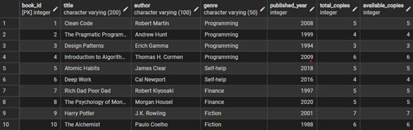

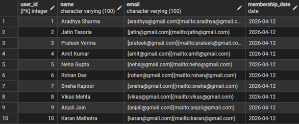

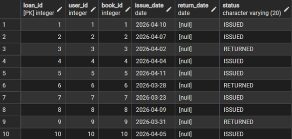

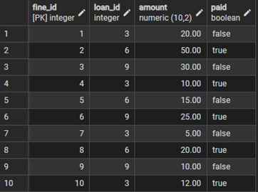
 

2.	Joins
 
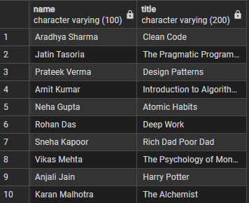

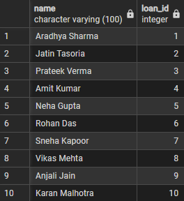
 

3.	Aggregate functions
 
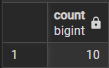

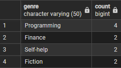
 
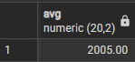

 

4.	Window functions
 
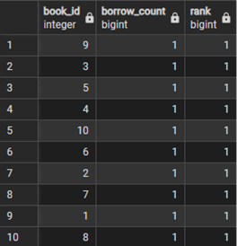

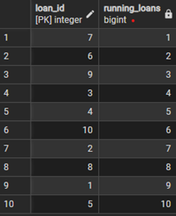

5.	Update queries
 
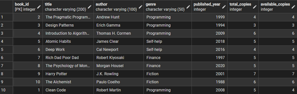

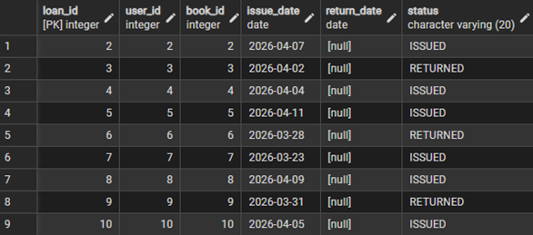
 

6.	Delete queries
 
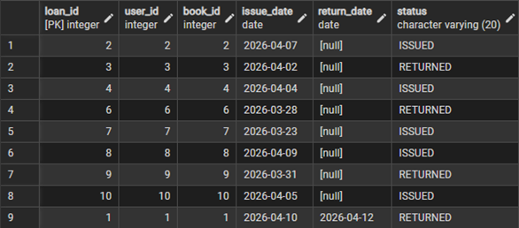

7.	Views
  
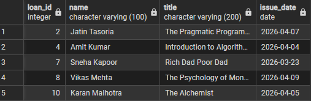

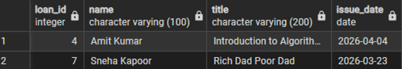

8.	Stored procedures
 
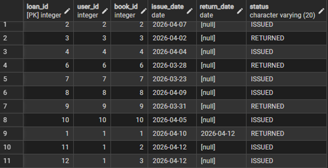

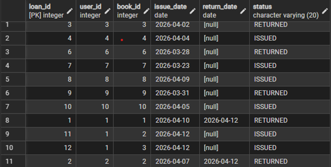
 

9.	Triggers

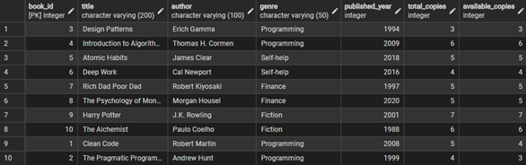

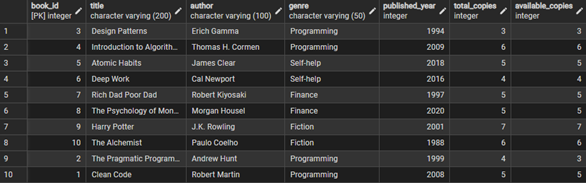
 
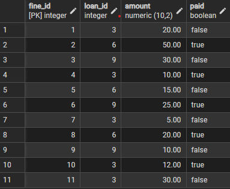

10.	Advanced queries

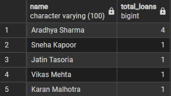
 
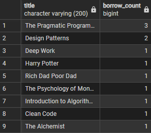

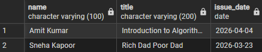

 
 
## Future Development

While the current database architecture successfully automates and manages library data, future iterations could enhance the enterprise capabilities of the system:
•	Application Integration: Connecting this PostgreSQL backend to a frontend web application (using Node.js or Python/Django) to provide a graphical user interface for library patrons to search catalogs and view their personal fines.

•	Advanced Notification Triggers: Integrating the database with an external messaging queue to automatically email members when a book's due date is approaching, utilizing PostgreSQL's NOTIFY command.

•	Role-Based Access Control (RBAC): Implementing strict database user roles using DCL (Data Control Language) to grant specific read/write permissions to Admins, Librarians, and read-only access to standard system services.

•	Cloud Database Migration: Migrating the local PostgreSQL instance to a fully managed cloud service like Azure Database for PostgreSQL or Amazon RDS to guarantee high availability and automated disaster recovery backups.

---
 
## Conclusion

The "Library Management System" successfully demonstrates the power of structured data management and relational database engineering. By migrating away from manual data tracking, this project realized a highly efficient, automated ecosystem utilizing PostgreSQL.

The integration of primary and foreign keys alongside normalized tables proved essential in eliminating data redundancy and maintaining consistency. Furthermore, the implementation of advanced PL/pgSQL triggers completely modernized the process of inventory tracking and fine management, removing the potential for human error. This project provided profound, practical exposure to advanced schema design, query optimization, window functions, and procedural logic, establishing a robust foundation in modern database administration. 

---

## Learning Outcomes

Upon the successful completion of the "Library Management System," several critical technical and architectural competencies were achieved. The project served as a comprehensive practical exercise, resulting in the following key learning outcomes:
•	Advanced Relational Design: Gained practical experience in conceptualizing complex ER models and translating them into strictly normalized schemas using PostgreSQL.

•	Database Automation: Mastered the syntax and logic of PL/pgSQL to write custom stored procedures and event-driven triggers, enabling the database to perform automated, self-sustaining actions.

•	Complex Data Retrieval: Developed proficiency in writing advanced SQL queries, specifically leveraging Subqueries and Window Functions (RANK, running totals) to perform deep data analytics directly within the database engine.

•	Data Abstraction: Learned to leverage logical Views to simplify complex underlying data structures for reporting purposes and dashboard integration.

•	Referential Integrity Troubleshooting: Enhanced debugging skills by resolving strict foreign key constraint violations and optimizing procedural logic during trigger creation.
 
---

## References

•	PostgreSQL Global Development Group. (n.d.). PostgreSQL Official Documentation.
https://www.postgresql.org/docs/

•	W3Schools. (n.d.). SQL Tutorial.
https://www.w3schools.com/sql/

•	Elmasri, R., & Navathe, S. B. (2015). Fundamentals of Database Systems (7th ed.). Pearson.

The SQL scripts and project files can be found at:
https://github.com/AradhyaSharma31/library_management_DBMS_mini_project
